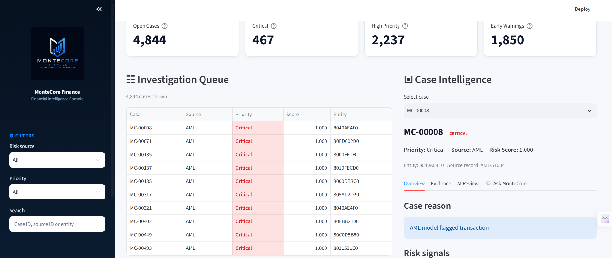
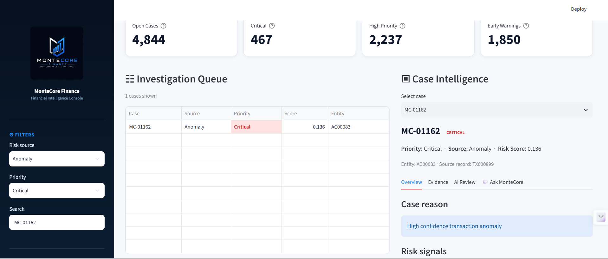
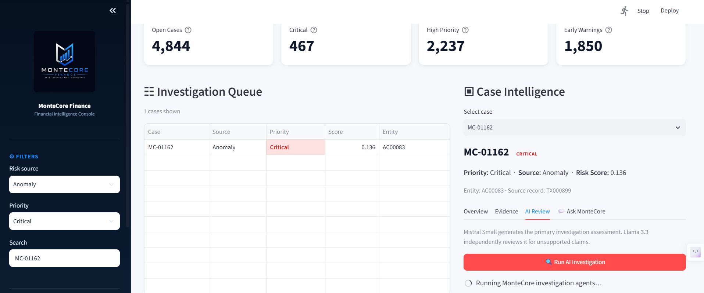
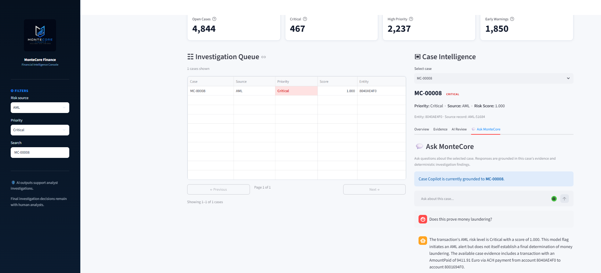
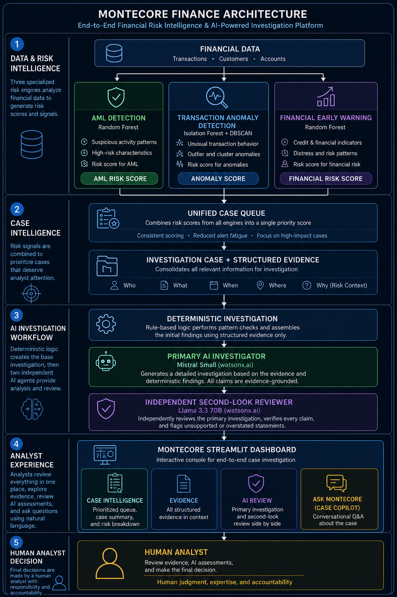

# MonteCore Finance

> **See the Risk Before It Becomes the Problem.**

**MonteCore Finance** is an end-to-end financial risk intelligence and investigation platform that combines machine learning, anomaly detection, agentic AI, and human-in-the-loop decision support.

It brings three complementary risk signals - **AML detection, transaction anomaly detection, and financial early-warning scoring** - into a unified investigation workflow where analysts can prioritize cases, inspect evidence, generate AI-assisted assessments, and ask grounded questions about individual cases.

---
## Project Snapshot

- **3 complementary risk engines:** AML detection, transaction anomaly detection, and financial early-warning
- **Multi-agent investigation:** Mistral primary investigator + Llama 3.3 independent second-look reviewer
- **Grounded Case Copilot:** Natural-language investigation over structured case evidence
- **Human-in-the-loop design:** AI outputs support analyst decisions rather than making autonomous financial determinations
- **Interactive application:** Streamlit analyst dashboard for case prioritization, evidence review, AI-assisted investigation, and case-specific questioning

**Tech: Python • scikit-learn • pandas • NumPy • IBM watsonx.ai • Mistral • Llama 3.3 • Streamlit**
---
## Analyst Dashboard

MonteCore provides an interactive Streamlit investigation workspace that brings risk prioritization, structured evidence, AI-assisted investigation, and conversational case analysis into a single analyst interface.

### Investigation Queue

Analysts can filter and search the unified queue across AML, transaction-anomaly, and financial-risk cases.



### Case Evidence

Each case exposes the structured evidence used by the investigation workflow, allowing analysts to inspect the underlying model and transaction context.



### AI-Assisted Investigation

The AI Review workspace surfaces the primary investigation assessment together with an independent second-look review designed to identify unsupported or overstated claims.



### Grounded Case Copilot

Ask MonteCore allows analysts to question the selected case in natural language. Responses are grounded in available case evidence and reviewed before being presented to the analyst.



## Overview

Financial institutions generate large volumes of transaction, account, and customer data. Detecting a potentially risky event is only the beginning of an investigation.

Analysts must still determine:

- Why was the transaction or customer flagged?
- What evidence supports the risk signal?
- Which cases require attention first?
- What additional evidence would help the investigation?
- How should model-generated signals be interpreted without treating them as final decisions?

MonteCore Finance explores an end-to-end approach to this problem.

The platform combines three machine-learning risk engines with a unified case-prioritization layer, deterministic evidence generation, a multi-agent AI investigation workflow, and an interactive analyst dashboard.

AI-generated assessments are treated as **decision support rather than autonomous financial decisions**. Final investigation conclusions remain with the human analyst.

---

## Key Capabilities

### AML Risk Detection

A supervised Random Forest model identifies transactions resembling labelled money-laundering activity and produces risk signals for downstream investigation.

The operating threshold is tuned toward higher recall so potentially relevant transactions can be surfaced for analyst review.

### Transaction Anomaly Detection

An unsupervised detection pipeline combines **Isolation Forest and DBSCAN** with behavioural transaction features.

Model agreement and anomaly-confidence levels help distinguish stronger behavioural anomalies from weaker individual model signals.

### Financial Early-Warning Engine

A class-balanced Random Forest identifies customers showing elevated near-term financial risk using repayment behaviour and engineered financial-stress indicators.

Signals include delayed payments, repayment deterioration, payment-to-bill behaviour, credit utilization, and combined stress indicators.

### Unified Risk & Case Prioritization

Outputs from the three risk engines are converted into a common investigation queue with:

- Case IDs
- Risk source
- Priority
- Risk score
- Entity or transaction identifiers
- Risk reason
- Supporting context

This allows heterogeneous ML signals to enter a single analyst workflow.

### Agentic Investigation Engine

Each selected case is transformed into a structured investigation object containing its risk signals, evidence, context, deterministic findings, and recommended actions.

A primary AI agent generates an evidence-grounded investigation assessment while an independent second-look agent reviews the draft for unsupported or overstated claims.

### Case Copilot

Analysts can ask natural-language questions about the selected case directly from the dashboard.

Case Copilot answers using the supplied case evidence and deterministic investigation context, with a second AI review step designed to reduce unsupported claims before the response reaches the analyst.

### Analyst Dashboard

A Streamlit application provides an interactive investigation console with:

- Risk-source and priority filters
- Case search and pagination
- Investigation queue
- Case intelligence view
- Evidence inspection
- Deterministic findings and actions
- AI-generated investigation assessments
- Independent second-look review
- Case-specific conversational Copilot

---

## Human-in-the-Loop by Design

MonteCore Finance does **not** treat anomaly scores, AML model outputs, financial-risk scores, or AI-generated assessments as final determinations.

The system separates:

**Detection → Evidence → Investigation → AI Review → Human Decision**

This design keeps machine learning and generative AI in a decision-support role while preserving analyst responsibility for final investigation outcomes.

---

## System Architecture

MonteCore Finance connects three independent risk-detection pipelines to a unified investigation and analyst decision-support layer. The three detection engines remain independent so that different forms of financial risk can be represented without collapsing them into a single opaque score.



---

## Agentic Investigation Workflow

MonteCore uses a layered investigation architecture rather than sending raw model outputs directly to a language model.

### 1. Structured Case Construction

A flagged record is converted into an `InvestigationCase` containing:

- Case and entity identifiers
- Risk source and priority
- Model-generated risk signals
- Transaction or customer context
- Structured supporting evidence

This gives downstream agents an explicit evidence boundary.

### 2. Deterministic Investigation

Before generative AI is called, MonteCore produces deterministic findings and recommended actions from the available case evidence.

This layer remains available even if the external AI service fails.

### 3. Primary AI Investigator — Mistral Small

The primary investigation agent receives the structured case and deterministic result.

Its instructions require it to:

- Use only supplied evidence
- Separate observations from interpretations
- Avoid unsupported fraud or AML conclusions
- Avoid inventing identities, motives, or security compromises
- Generate an analyst-oriented assessment
- Preserve human responsibility for the final decision

### 4. Independent Second-Look Review — Llama 3.3

A separate model reviews the primary assessment against the original ground-truth case evidence.

The reviewer checks for failure modes including:

- Invented facts
- Unsupported motives
- Unsupported account-compromise claims
- Ungrounded identities
- Overstated conclusions
- Final fraud or AML determinations
- Ungrounded recommended actions

The reviewer returns either:

`PASS`

or:

`NEEDS_CORRECTION`

When correction is required, the reviewer produces a revised assessment grounded in the available evidence.

### 5. Case Copilot

The same grounding principle is applied to conversational case analysis.

An analyst can ask questions such as:

- Why was this case flagged?
- Does this evidence establish fraud or money laundering?
- What evidence supports the current risk level?
- What additional evidence would be useful?

The generated answer is reviewed before being presented to the analyst.

### 6. Graceful Degradation

The orchestration layer isolates failures at the AI stages.

If the primary AI service is unavailable, MonteCore still preserves and returns the deterministic investigation result rather than losing the entire investigation workflow. This allows the core evidence and rule-based decision-support layer to remain usable independently of generative AI availability.


---

## Machine Learning Results

MonteCore combines three complementary risk-detection approaches. Each engine addresses a different investigation problem and produces signals for the unified case workflow.

### AML Detection

The supervised AML pipeline was developed using IBM's synthetic Anti-Money Laundering dataset.

A Random Forest classifier was selected after comparison with Logistic Regression and a class-balanced Random Forest. The operating threshold was tuned on validation data to prioritize recall of labelled laundering transactions.

#### Held-Out Test Performance

| Metric | Result |
| --- | ---: |
| Precision | 0.510 |
| Recall | **0.763** |
| F1-score | **0.611** |
| PR-AUC | **0.620** |
| Labelled laundering transactions detected | **592 / 776** |
| Operating threshold | **0.21** |

The lower operating threshold intentionally accepts additional false-positive alerts in exchange for higher laundering recall and subsequent analyst review.

---

### Transaction Anomaly Detection

The anomaly engine uses Isolation Forest and DBSCAN to identify unusual transaction behaviour without requiring fraud labels.

From **2,512 transactions**:

| Result | Transactions |
| --- | ---: |
| Isolation Forest anomalies | 126 |
| DBSCAN noise points | 66 |
| Flagged by both models | **49** |
| Isolation Forest only | 77 |
| DBSCAN only | 17 |
| Medium/High-confidence cases prioritized | **143** |

Agreement between the two unsupervised models contributes to anomaly-confidence scoring.

An anomaly indicates unusual behaviour and is **not interpreted as confirmed fraud**.

---

### Financial Risk & Early Warning

The financial-risk engine was trained on a **30,000-customer credit-default dataset**.

A class-balanced Random Forest was selected over Logistic Regression because the early-warning objective prioritizes detection of genuinely risky customers.

#### Model Comparison

| Metric | Logistic Regression | Random Forest |
| --- | ---: | ---: |
| Accuracy | **0.815** | 0.778 |
| Default Precision | **0.649** | 0.499 |
| Default Recall | 0.352 | **0.589** |
| Default F1 | 0.456 | **0.541** |
| ROC-AUC | 0.754 | **0.778** |
| PR-AUC | 0.518 | **0.558** |

A prototype operating threshold of **0.45** was selected for the early-warning workflow.

At this threshold:

| Metric | Result |
| --- | ---: |
| Precision | 0.461 |
| Recall | **0.642** |
| F1-score | **0.536** |
| True positives | 852 |
| False negatives | 475 |
| Test customers prioritized | **1,850 / 6,000** |

#### Risk Stratification

| Risk Level | Customers | Observed Default Rate |
| --- | ---: | ---: |
| Low | 2,460 | 8.09% |
| Medium | 1,690 | 16.33% |
| High | 1,850 | **46.05%** |

The observed default rate rises substantially across the operational risk tiers, providing a useful prioritization signal for the investigation workflow.

Raw Random Forest scores are used for ranking and thresholding and should not be interpreted as perfectly calibrated probabilities.

---

## Evaluation & Testing

MonteCore Finance includes a dedicated evaluation suite covering the complete investigation workflow, from case construction through agentic AI review and conversational case analysis.

Testing was performed across representative cases from all three risk sources:

- AML risk
- Transaction anomaly risk
- Financial early-warning risk

### End-to-End Pipeline Validation

Pipeline smoke tests verify that the three risk engines successfully connect to the unified investigation workflow.

The evaluation confirmed:

- **4,844 cases** available in the unified investigation queue
- AML cases correctly map to their transaction evidence
- Anomaly cases correctly map to behavioural anomaly evidence
- Financial-risk cases correctly map to customer risk evidence
- Risk signals and supporting evidence are preserved during case construction

### Deterministic Investigation Testing

The deterministic investigation layer was tested independently of generative AI.

Tests verify:

- Case priority propagation
- Investigation summary generation
- Key findings
- Recommended analyst actions
- AML-specific review actions
- Critical-case escalation
- Financial-risk findings

This provides a non-generative investigation baseline that remains available even when the AI layer is unavailable.

### Multi-Agent AI Evaluation

The complete agentic workflow was evaluated across AML, anomaly, and financial-risk cases:

```text
Structured Evidence
        ↓
Deterministic Investigation
        ↓
Mistral Primary Assessment
        ↓
Llama Second-Look Review
        ↓
Analyst-Facing Assessment
```

The second-look reviewer successfully identified cases where the primary model introduced interpretations that went beyond the available evidence.

Examples included:

- Unsupported account-compromise interpretations
- Overstated fraud or suspicious-activity language
- Recommendations extending beyond deterministic actions
- Causal interpretations not established by the supplied evidence

When these issues were detected, the reviewer returned `NEEDS_CORRECTION` and generated a revised assessment grounded in the original case evidence.

### Case Copilot Evaluation

Case Copilot was evaluated using multiple question types across all three risk sources.

Questions included both standard investigation queries and deliberately leading questions such as:

- "Why was this case flagged?"
- "Does this prove money laundering?"
- "Does this prove fraud or account takeover?"
- "Does this prove the customer will default?"
- "What additional evidence would be useful to investigate it?"

| Risk Source | Reviewed Questions | Passed |
| --- | ---: | ---: |
| AML | 3 | **3 / 3** |
| Transaction Anomaly | 3 | **3 / 3** |
| Financial Risk | 3 | **3 / 3** |
| **Total** | **9** | **9 / 9** |

The reviewed responses correctly distinguished model-generated risk signals from final investigation conclusions.

For example, the system did not treat:

- an AML model flag as proof of money laundering,
- an anomaly signal as proof of fraud or account takeover, or
- a high financial-risk score as proof that a customer will default.

### Robustness & Failure Handling

MonteCore was also tested under controlled failure conditions.

The robustness suite verifies:

- Invalid Case IDs produce explicit errors
- Missing watsonx credentials are detected clearly
- AI-service failure does not destroy the deterministic investigation result
- Second-look review is safely skipped when the primary AI stage cannot run

This graceful-degradation design allows core evidence and deterministic investigation capabilities to remain available independently of generative AI availability.

### Application Acceptance Testing

The Streamlit analyst application was manually validated end-to-end, including:

- Risk-source filtering
- Priority filtering
- Case search
- Queue pagination
- Case selection
- Overview and evidence views
- AI Review
- Case Copilot
- Case switching
- Conversation clearing
- Dashboard rendering and layout

Together, these tests evaluate not only model performance but also **system integration, grounding behaviour, failure handling, and analyst-facing usability**.

---

## Tech Stack

MonteCore Finance combines traditional machine learning, agentic AI, and an interactive analyst application in a modular Python architecture.

| Layer | Technologies |
| --- | --- |
| Programming | Python |
| Data Processing | pandas, NumPy |
| Machine Learning | scikit-learn |
| Supervised Models | Random Forest, Logistic Regression |
| Unsupervised Models | Isolation Forest, DBSCAN |
| Generative AI | IBM watsonx.ai |
| Primary Investigation Model | Mistral Small |
| Second-Look Review Model | Llama 3.3 |
| Application | Streamlit |
| Model Persistence | joblib |
| Development | VS Code, Jupyter Notebook |
| Version Control | Git, GitHub |

### Machine Learning

The ML layer includes:

- Leakage-aware preprocessing and feature engineering
- Supervised classification for AML and financial-risk detection
- Unsupervised anomaly detection
- Validation-based operating-threshold selection
- Class-imbalance handling
- Risk stratification and case prioritization
- Model evaluation using precision, recall, F1, ROC-AUC, and PR-AUC where appropriate

### Agentic AI

The investigation layer uses IBM watsonx.ai to orchestrate two distinct model roles:

**Mistral Small** acts as the primary investigation agent, generating structured assessments from supplied case evidence.

**Llama 3.3** acts as an independent second-look reviewer, checking the primary assessment for unsupported or overstated claims before information is surfaced to the analyst.

### Application Layer

The Streamlit interface connects the risk engines and investigation workflow into a single analyst-facing application supporting:

- Investigation queue exploration
- Filtering and case search
- Evidence inspection
- AI-assisted investigation
- Second-look review
- Conversational Case Copilot

---

## Repository Structure

MonteCore Finance is organized as a modular ML and agentic-AI application, separating experimentation, trained-model configuration, investigation logic, application code, documentation, and evaluation.

```text
montecore-finance/
│
├── agents/
│   ├── case_agent/
│   │   └── case_manager.py
│   │
│   └── investigation_agent/
│       ├── evidence.py
│       ├── investigator.py
│       ├── orchestrator.py
│       ├── schemas.py
│       └── watsonx_client.py
│
├── app/
│   └── dashboard.py
│
├── assets/
│   └── montecore_logo.png
│
├── data/
│   ├── raw/
│   └── processed/
│
├── docs/
│   ├── aml_model.md
│   ├── anomaly_detection.md
│   ├── dataset_strategy.md
│   └── financial_risk_engine.md
│
├── models/
│   ├── financial_risk_features.json
│   ├── financial_risk_policy.json
│   └── transaction_anomaly_features.json
│
├── notebooks/
│   ├── 01_ibm_aml_eda.ipynb
│   ├── 02_aml_modeling.ipynb
│   ├── 03_transaction_anomaly_detection.ipynb
│   ├── 04_financial_risk_early_warning.ipynb
│   ├── 05_investigation_agent.ipynb
│   └── 06_unified_case_engine.ipynb
│
├── tests/
│   ├── test_agentic_evaluation.py
│   ├── test_case_chat.py
│   ├── test_copilot_evaluation.py
│   ├── test_deterministic_engine.py
│   ├── test_pipeline.py
│   └── test_robustness.py
│
├── .env.example
├── .gitignore
├── README.md
└── requirements.txt
```

### Key Modules

**`agents/case_agent/`**  
Builds investigation cases from the unified risk queue and connects risk signals with the appropriate transaction, customer, and supporting evidence.

**`agents/investigation_agent/`**  
Contains the deterministic investigation logic, evidence handling, investigation schemas, agent orchestration, watsonx integration, primary AI investigator, second-look reviewer, and Case Copilot.

**`app/`**  
Contains the Streamlit analyst console used to explore the investigation queue, inspect evidence, run AI-assisted reviews, and interact with Case Copilot.

**`notebooks/`**  
Documents the analytical development path from AML data exploration through supervised modelling, anomaly detection, financial early-warning modelling, agentic investigation, and unified case prioritization.

**`tests/`**  
Contains pipeline, deterministic-engine, multi-agent, Case Copilot, and robustness evaluations used to validate the end-to-end system.

**`docs/`**  
Contains detailed methodology and modelling documentation for the individual risk engines and dataset strategy.

**`models/`**  
Contains lightweight feature and policy configuration files required to describe model behaviour. Large serialized model artifacts are excluded from version control.

**`data/`**  
Provides the expected raw and processed data structure. Large datasets and generated data artifacts are excluded from version control.

---

## Running MonteCore Locally

### Prerequisites

- Python 3.10+
- Git
- IBM Cloud / watsonx.ai credentials for the generative-AI investigation features

### 1. Clone the Repository

```bash
git clone https://github.com/samarapires-ml/montecore-finance.git
cd montecore-finance
```

### 2. Create a Virtual Environment

**Windows**

```powershell
python -m venv .venv
.venv\Scripts\activate
```

**macOS / Linux**

```bash
python -m venv .venv
source .venv/bin/activate
```

### 3. Install Dependencies

```bash
pip install -r requirements.txt
```

### 4. Configure watsonx.ai

Copy the provided environment template:

**Windows**

```powershell
Copy-Item .env.example .env
```

**macOS / Linux**

```bash
cp .env.example .env
```

Then populate `.env` with your own credentials:

```env
IBM_CLOUD_API_KEY=your_api_key
IBM_PROJECT_ID=your_project_id
IBM_WATSONX_URL=your_watsonx_url
```

Never commit the `.env` file. It is excluded through `.gitignore`.

### 5. Data and Model Artifacts

Large raw datasets, processed datasets, NumPy arrays, and serialized model artifacts are intentionally excluded from this repository.

The analytical workflow is documented through the numbered notebooks and methodology files under `docs/`.

Expected local directories include:

```text
data/raw/
data/processed/
models/
```

The Streamlit application expects the generated risk outputs used by the unified case engine to be available locally.

### 6. Launch the Analyst Dashboard

From the project root:

```bash
streamlit run app/dashboard.py
```

Streamlit will start the MonteCore Finance analyst console in your browser.

### 7. Run the Evaluation Suite

Individual evaluation modules can be executed from the project root:

```bash
python -m tests.test_pipeline
python -m tests.test_deterministic_engine
python -m tests.test_agentic_evaluation
python -m tests.test_copilot_evaluation
python -m tests.test_robustness
```

Tests involving the Mistral and Llama agents require valid watsonx.ai credentials and make live model-inference calls.

---

> **Reproducibility note:** MonteCore Finance is a project prototype for the IBM AI Agent challenge rather than a packaged production banking system. Large third-party datasets and generated model binaries are not distributed through this repository.

---
For detailed system-level evaluation results, see [`docs/evaluation.md`](docs/evaluation.md).


## Limitations & Responsible Use

MonteCore Finance is a **portfolio and research prototype** designed to demonstrate machine-learning risk detection, evidence-grounded agentic AI, and human-in-the-loop financial investigation workflows.

It is not a production AML, fraud-detection, credit-decisioning, or regulatory compliance system.

### Dataset Limitations

The project uses public and/or research datasets representing different financial-risk problems.

As a result:

- The three risk engines do not operate on a single real financial institution's customer population.
- Synthetic or benchmark data may not reproduce the complexity, noise, distribution shifts, or operational constraints of real banking environments.
- Performance reported in this repository should not be interpreted as expected production performance.

### Model Scores Are Risk Signals

Outputs from the AML, anomaly, and financial-risk engines are treated as **investigation signals rather than factual determinations**.

In particular:

- An AML score does not prove money laundering.
- An anomaly does not prove fraud or account compromise.
- A financial-risk score does not prove that a customer will default.
- Random Forest scores should not automatically be interpreted as calibrated probabilities.

Thresholds used in this prototype represent analytical operating points and would require further validation, calibration, governance, and cost-sensitive analysis before real-world deployment.

### Generative AI Limitations

Large language models can produce unsupported, incomplete, or incorrectly interpreted statements even when supplied with structured evidence.

MonteCore reduces this risk through:

1. Structured evidence boundaries
2. Deterministic investigation findings
3. Grounding instructions for the primary agent
4. Independent second-look AI review
5. Explicit separation between observations and conclusions
6. Human analyst responsibility for final decisions

The second-look reviewer reduces risk but does **not guarantee factual correctness**. It is itself an AI model and may fail to identify an unsupported statement or may introduce errors during correction.

### Human-in-the-Loop Requirement

MonteCore is designed for analyst decision support.

The system should not autonomously:

- Determine that a person committed fraud or money laundering
- File regulatory reports
- Block or close accounts
- Deny credit
- Take enforcement action
- Make consequential financial decisions about individuals

Final decisions require appropriately authorized human review and access to evidence beyond the prototype datasets.

### Production Considerations

A real deployment would require additional controls including:

- Model validation and monitoring
- Probability calibration where appropriate
- Drift and data-quality monitoring
- Bias and fairness assessment
- Explainability and auditability
- Role-based access control
- Authentication and authorization
- Encryption and secure secret management
- Logging and investigation audit trails
- Data lineage and retention controls
- LLM prompt and response monitoring
- Adversarial and red-team evaluation
- Regulatory and legal review
- Formal human-oversight procedures

These requirements are intentionally outside the scope of the current portfolio prototype.

---

## Future Improvements

MonteCore Finance provides an end-to-end prototype, but several extensions could move the system closer to a production-grade financial investigation platform.

### Model Development

- Calibrate supervised risk scores for improved probability interpretation
- Evaluate additional gradient-boosting and ensemble approaches
- Add temporal and sequence-based transaction features
- Introduce model and feature drift monitoring
- Evaluate performance across demographic and operational subgroups
- Add cost-sensitive threshold optimization based on analyst capacity and investigation cost

### Investigation Intelligence

- Retrieve additional evidence dynamically from approved internal data sources
- Add entity and counterparty relationship analysis
- Introduce transaction-network and graph-based investigation features
- Track evidence provenance at the individual-claim level
- Add confidence and evidence-strength indicators to AI-generated assessments
- Expand adversarial evaluation of the primary investigator and second-look reviewer

### Analyst Experience

- Add analyst feedback and case-disposition workflows
- Support investigation notes and evidence annotations
- Add case assignment and collaboration
- Introduce investigation timelines
- Add richer case-level visualizations
- Persist Case Copilot conversations securely
- Add role-based access controls and audit logging

### Deployment & MLOps

- Package data preparation and model inference into reproducible pipelines
- Add automated testing through CI/CD
- Containerize the application
- Introduce model versioning and experiment tracking
- Add production monitoring and observability
- Replace local model artifacts with governed model-registry infrastructure

---

## Project Highlights

MonteCore Finance demonstrates an end-to-end approach to financial risk intelligence spanning:

**Data Engineering → Feature Engineering → Supervised ML → Unsupervised ML → Risk Scoring → Case Prioritization → Deterministic Investigation → Agentic AI → AI Grounding Review → Conversational Copilot → Human Analyst Decision Support**

The project was designed to explore a central question:

> **How can machine learning and generative AI help financial analysts investigate risk without turning probabilistic model outputs into unsupported conclusions?**

MonteCore addresses this through complementary risk engines, structured evidence, deterministic investigation logic, independent AI review, explicit failure handling, and human-in-the-loop decision making.

---

## Author

**Samara Pires**
Master's student in Modelling, Data & Predictions at the University of Alberta.

**Hana Antonio**
DPhil Student at University of Oxford 

Built as an end-to-end machine learning and agentic-AI Project focused on financial risk intelligence, investigation, and responsible AI-assisted decision support for the IBM AI Agent Challenge. 

---

## Disclaimer

MonteCore Finance is an educational and portfolio prototype. It is not intended for production financial decision-making, regulatory compliance, or use as a substitute for qualified human investigation.

---

